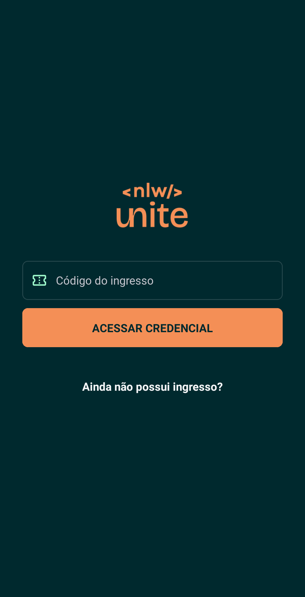
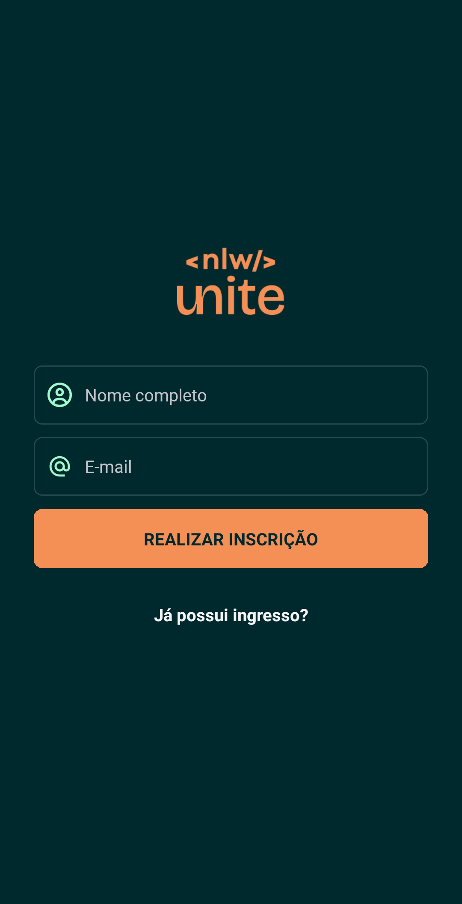
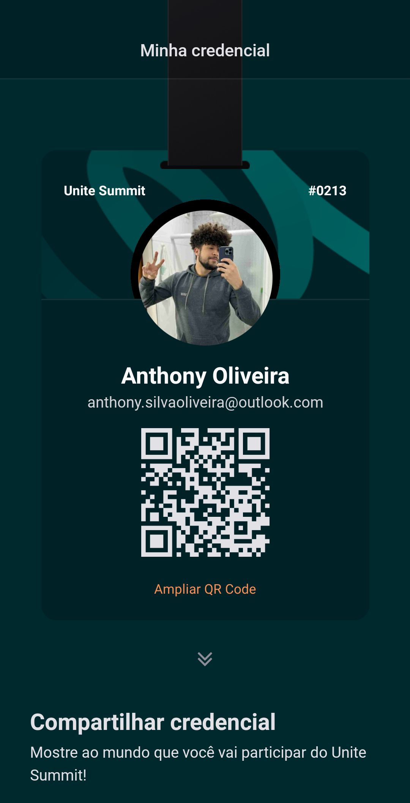
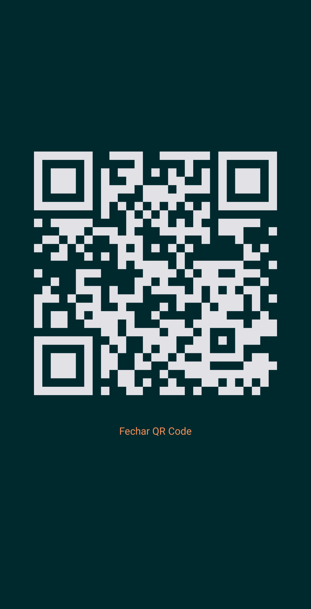

<p align="center" style="display: flex; align-items: center; gap: 20px; justify-content: center;">
    
    
    
</p>

<p align="center" style="display: flex; flex-direction: column; align-items: center; gap: 5px;">
    
    <h1 align="center">
        My Credential
    </h1>
</p>

### :computer: **Sobre o projeto**

Projeto criado durante a nlw da Rocketseat entre os dias 02/abril/2024 e 04/abril/2024, onde foi criado uma aplicação para gerar uma credencial para o Unite Summit!

### :art: **Layout**

<p align="center">
    
    
    
    
</p>


### :wrench: **Tecnologias utilizadas**

- [Expo](https://docs.expo.dev/)
- [React Native](https://reactnative.dev/)
- [Zustand](https://docs.pmnd.rs/zustand/getting-started/introductio)
- [Node.JS](https://nodejs.org/en)
- [TypeScript](https://www.typescriptlang.org/)
- [Moti](https://moti.fyi/installation)

## :zap: Executando o projeto

```bash
npm install
npm start
```

ou

```bash
yarn
yarn start
```
